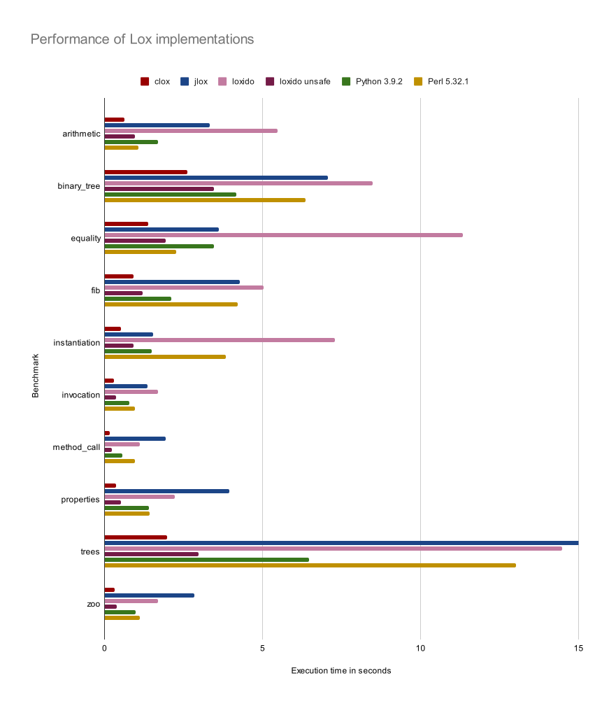

# Loxido

A [Rust](https://www.rust-lang.org/) implementation of the Lox programming
language from the amazing book [Crafting
Interpreters](https://craftinginterpreters.com/) by Bob Nystrom.

This is based on the [clox reference
implementation](https://github.com/munificent/craftinginterpreters) in C. It
implements a byte-code compiler and VM.

You can read a detailed blog post about this here:

https://ceronman.com/2021/07/22/my-experience-crafting-an-interpreter-with-rust/

This implementation passes the 243 integration tests from *clox* and *jlox*.

## Two branches

This repository contains two main branches:

- The [master](https://github.com/ceronman/loxido/tree/unsafe) branch is written
using purely safe code. As a result it's quite slower than the *clox* reference
implementation.

- The [unsafe](https://github.com/ceronman/loxido/tree/unsafe) branch is based
on the master code but it introduces some unsafe Rust code. It has a different
GC implementation and some hand-written data structures, including a *Stack* and
*HashMap*. This version is almost as fast as *clox* (see benchmarks bellow).

## Differences between loxido and clox

The safe implementation follows the design of *clox*, but trying to
be Rust idiomatic. Some of the differences are:

- The design of the GC is quite different to adapt to Rust safety limitations.
A vector is used to store objects allocated and another vector of *tombstones*
is used to keep track of deleted objects. Trait based polymorphism is used to
implement different tracing strategies for different objects.

- The GC doesn't run while compiling code, only when the VM is running. This
simplifies dealing with the borrow checker.

- The GC is not able to precisely keep track of all the allocated bytes; only an
approximation. For this reason, the GC behavior might be less predictable.

- For the most part, data structures from the Rust standard library are used.
This includes *vectors*, *hashmaps* and *strings*.

- The VM uses fixed length instructions, as opposed to the variable length from
clox. This allows using enums for instructions, which makes the code nicer to
write.

- This implementation avoids *NaN Boxing* completely.

## Changes in the *unsafe* branch

The [unsafe](https://github.com/ceronman/loxido/tree/unsafe) branch introduces
some unsafe code to improve performance. The changes are:

- Using raw pointers to keep track of the current frame and bytecode chunk on
every cycle of the VM.

- Redesigned GC using raw pointers, very similar to the one used in clox.
Although objects are represented as an enum instead of trait objects to avoid
dynamic dispatch.

- Stack is implemented using an array and a raw pointer indicating the top.
Similar to clox.

- The Program Counter (PC) is implemented using a raw pointer.

- Custom *HashMap* implementation based on the code from *clox*.

## How to run

To compile and run this project you need 
[Cargo](https://doc.rust-lang.org/cargo/).

To run the REPL, just go for:

```
cargo run
```

To run a specific file:

```
cargo run program.lox
```

## Running the tests

To run the tests just run:

```
cargo test
```

## Performance

I measured the running times of the different benchmarks available in the [lox
repository](https://github.com/munificent/craftinginterpreters). I also ported
the benchmarks to Python and Perl. Here are the compared running times of
different implementations of Lox, including mind.

These were run on my Thinkpad X1 laptop with Intel Core i7-8565U CPU


  **note**: The horizontal axis is capped at 15 seconds to improve visibility.


|                   |     clox     |      jlox     |     loxido     | loxido unsafe |  Python 3.9.2 |  Perl 5.32.1 |
| ----------------- | :----------: | :-----------: | :------------: | :-----------: | :-----------: | :----------: |
| **arithmetic**    |   0.6304s    |    3.3200s    |    5.4746 s    |    0.9706s    |    1.6815s    |    1.0798s   |
| **binary_tree**   |   2.6283s    |    7.0670s    |    8.4780 s    |    3.4534s    |    4.1730s    |    6.3510s   |
| **equality**      |   1.3740s    |    3.6209s    |    11.337 s    |    1.9433s    |    3.4657s    |    2.2632s   |
| **fib**           |   0.9067s    |    4.2789s    |    5.0318 s    |    1.2042s    |    2.1110s    |    4.2134s   |
| **instantiation** |   0.5264s    |    1.5280s    |    7.2826 s    |    0.9068s    |    1.4895s    |    3.8319s   |
| **invocation**    |   0.2916s    |    1.3600s    |    1.6865 s    |    0.3566s    |    0.7789s    |    0.9535s   |
| **method_call**   |   0.1574s    |    1.9440s    |    1.1231 s    |    0.2255s    |    0.5696s    |    0.9560s   |
| **properties**    |   0.3716s    |    3.9539s    |    2.2317 s    |    0.5132s    |    1.4074s    |    1.4339s   |
| **trees**         |   1.9714s    |    21.677s    |    14.478 s    |    2.9840s    |    6.4791s    |    13.019s   |
| **zoo**           |   0.3132s    |    2.8380s    |    1.6914 s    |    0.3836s    |    0.9739s    |    1.1222s   |


## Tree walker implementation

I also wrote another implementation of the tree walk interpreter in Clojure
called [cloxure](https://github.com/ceronman/cloxure).

## Copyright note

Most of the test and benchmark files are copied from [Crafting Interpreters
repository](https://github.com/munificent/craftinginterpreters). The copyright
for these belongs to Bob Nystrom and are copied here because their license
allows it (MIT).

The source code for this implementation is copyright of Manuel Cerón. And it's
also licensed as MIT (see [LICENCE](LICENSE) for details.)
